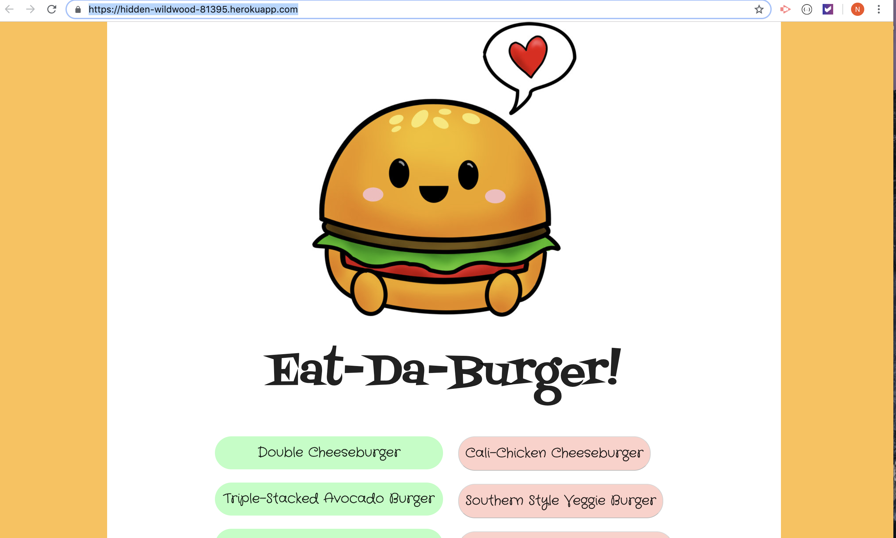
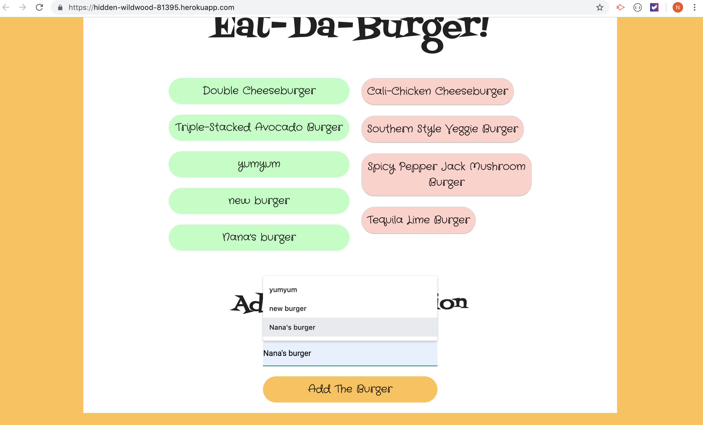
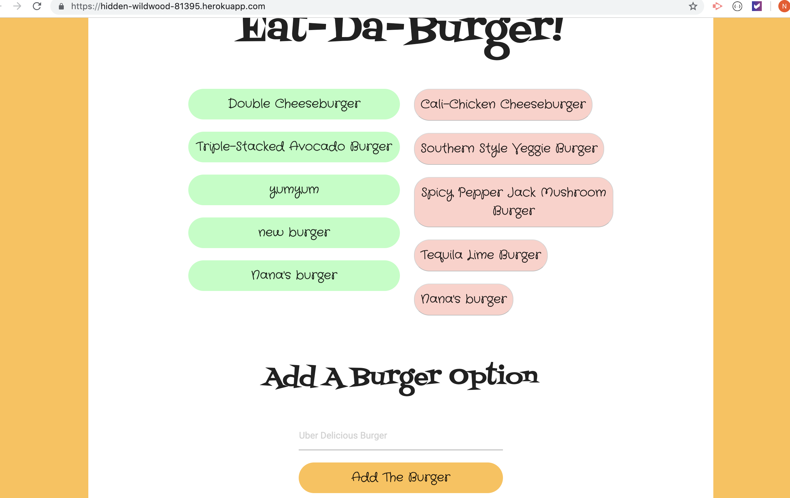

# Eat-Da-Burger!
The goal was to create a Burger App using Node Express Handlebars and our own ORM. It uses the MVC design pattern, Node and MySQL to query and route data to the app and Handlebars to generate the HTML.

### Click this link to see the app : https://hidden-wildwood-81395.herokuapp.com/
## Technologies used

* Node.js
* MySQL
* Handlebars - http://handlebarsjs.com/
* body-parser NPM Package - https://www.npmjs.com/package/inquirer
* express NPM Package - https://www.npmjs.com/package/express
* mysql NPM Package - https://www.npmjs.com/package/mysql
* handlebars NPM Package - https://www.npmjs.com/package/handlebars
* express-handlbars NPM Package - https://www.npmjs.com/package/express-handlebars

### Functionality
Using an home-grown ORM, the app has 3 basic CRUD functions...

* READ all entries from the MySQL database and display them to the DOM using Handlebars.

* UPDATE a selected burger by clicking "Devour It", which... * hits an /api/burgers/:id route in Express to change its "devoured" status in the MySQL database * re-routes the webpage back to the index, where the burger is now in the devoured column (via Handlebars).

* CREATE a new burger using the "Add a Burger Option" , which... * hits a /api/burgers route in Express to insert a new burger into the MySQL database * re-routes the webpage back to the index, where the burger is now ready to be eaten column (via Handlebars)

## ScreenShots

## Authors
* Nadire Ghalip - JS/Node.js/Handlebars
